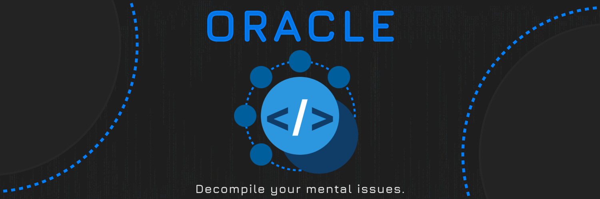

# DataModelPatch

The most accurate decompilation of Roblox Player's DataModelPatch

### Credits

* [Oracle](https://discord.gg/prHW9TA4QW), most accurate decompiler on the planet and a really fast one, for decompiling the Bytecode

## 🚫 Problems

* Some files may have had unhandled control flow and improperly decompiled, which would result in incorrect table and `goto` output
* You'd have to manually fix it if possible

## 🏛️ Licensing

Some of the original source code from DataModelPatch is/was licensed under the Apache-2.0 license, while some is also proprietary and exclusively owned by Roblox Corporation ("Roblox"). Furthermore, any source code from this decompilation should be considered unlicensed code.

## Decompiler

These files were decompiled by the Oracle decompiler. 

Discord Invite: https://discord.gg/prHW9TA4QW

